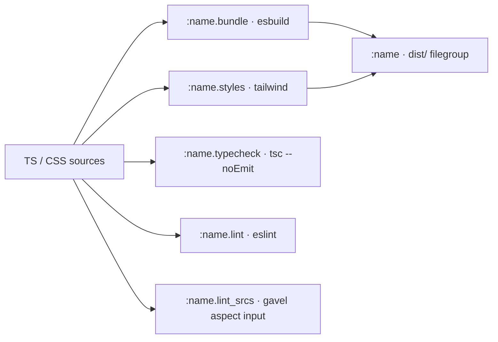

# web_project macro

`@gavel_tools//macros:web.bzl%web_project` generates a frontend app's entire
Bazel build graph — esbuild bundle, tailwind CSS, production `dist/`, `tsc`
type-check and ESLint — from a single declaration, so a consumer stops
hand-wiring the bundler, `copy_file`, tailwind and tool glue by hand. Owning
build complexity for the painful languages — not just linting — is this module's
mission.

> [!NOTE]
> The parameter list and the exact generated target names are the macro's own
> contract and live in its docstring (`macros/web.bzl`) — the source of truth
> this page does not copy, so it cannot drift. This page carries only what the
> code cannot say for itself: the shape of the graph and how ESLint behaves.

## The generated graph

Per-tool npm binaries (eslint / tsc / tailwind) come from the **consumer's** own
lockfile and are passed in, so tool versions stay consumer-owned. From the
sources the macro derives one build path and four checks:

`:name.typecheck` and `:name.lint` run under `bazel test`; `:name.lint_srcs` is
the `js_library` the hermetic gavel ESLint aspect runs over — it carries the
sources, flat config and plugin closure on `JsInfo` so the aspect can declare
them as sandbox inputs. There is no runnable target: a frontend is served
embedded by the backend, and dev (watch / HMR) runs outside Bazel.

## Type-aware ESLint

Type-aware `@typescript-eslint` rules (`no-floating-promises`, `no-unsafe-*`,
`no-misused-promises`, …) run through the hermetic aspect **with no aspect or
macro change** — the aspect already declares `JsInfo.transitive_sources`
(tsconfig + type deps) and `JsInfo.npm_sources` (plugin closure) as sandbox
inputs. Turning them on is purely a consumer-config decision:

- extend `tseslint.configs.recommendedTypeChecked` and set
  `parserOptions.projectService: true` with `tsconfigRootDir: import.meta.dirname`
  in the flat config;
- declare the closure the program needs on `web_project`: `type_deps`
  (`typescript`, `@types/*`) and `lint_deps` (`typescript-eslint`, …), so it
  reaches the sandbox.

> [!IMPORTANT]
> Give test files their own **non-type-aware** config block. `projectService`
> builds its TypeScript program from the app tsconfig; any file that tsconfig
> excludes — typically `*.test.*` — is reported as "not found by the project
> service" and hard-errors. Match `**/*.test.{ts,tsx}` to a syntactic-only block
> so the parser never asks the program about it.

# Citations

- Why the hermetic ESLint run is fragile, and the contract for keeping it
  working across `rules_js` / ESLint bumps: [The hermetic analyzer driver](tier-model.md).
